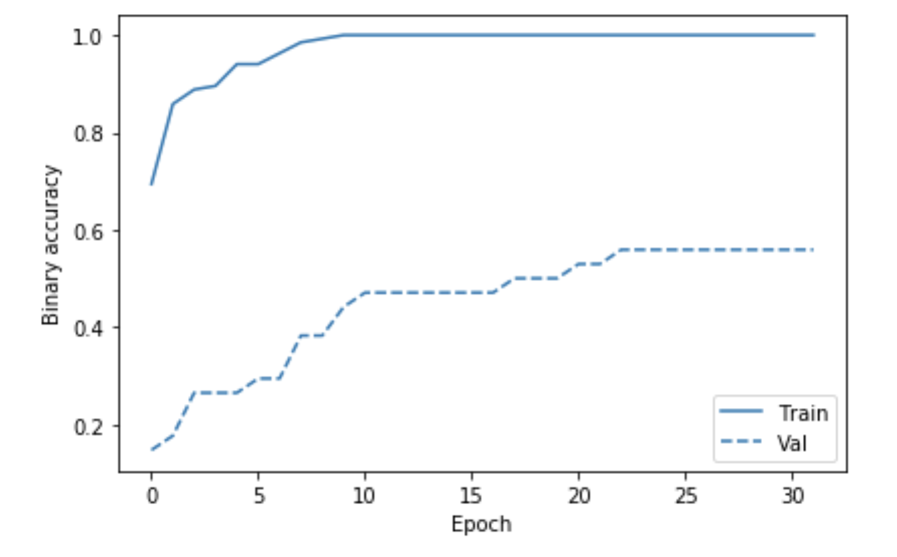
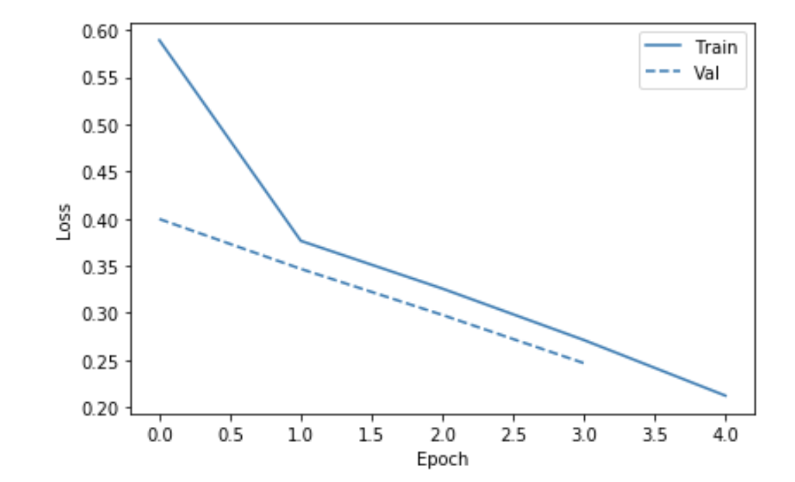

# HW 2 MLP ie7860

The MLP assignment expolores two datasets, one is highly unbalanced and another rather short. First the performance of manualy designed networks is evluated then the hyper-parameter turning is performed using Scikit-Optimize and results compared. 

## Setup jupiter in virtial environment
```bash
python3 -m venv ds
. ds/bin/activate
pip install --upgrade pip
pip install -r req.txt 
jupyter nbextension enable --py --sys-prefix ipympl
jupyter notebook &
```

## Datasets

### Thyroid

* http://archive.ics.uci.edu/ml/datasets/Thyroid+Disease
* http://fizyka.umk.pl/kis-old/projects/datasets.html#Hypothyroid

Thyroid dataset has 21 features (15 binary, 6 continuous) and divided into 3 classes.  There are 3772 training and 3428 testing examples; primary hypothyroid, compensated hypothyroid, normal (not hypothyroid). 

Training set [ann-train.data](ann-train.data): 
 - 93 of class 1 or 2.47%
 - 191 of class 2 or 5.06%
 - 3488 of class 3 or 92.47%

Test set [ann-test.data](ann-test.data): 
 - 73 of class 1 or 2.13%
 - 177 of class 2 or 5.16%
 - 3178 of 92.71%

Because 92 percent of the patients are not hyperthyroid the good classifier must be better than 92%.
The dataset has imbalanced representation of the classes that poses a problem for trainig Neural Networks. While there is a way to use [Class Wheight](https://www.tensorflow.org/tutorials/structured_data/imbalanced_data) technique, this paper uses [Oversampling of minority class Resampling Technique](https://imbalanced-learn.readthedocs.io/en/stable/over_sampling.html). 

#### Oversampling of class 1 and 2 of Thyroid Dataset

TODO proper Oversampling

#### Density Plot of Continues features of the Training Dataset


#### Density Plot of Continues features of the Testing Dataset


### Sonar 

* http://archive.ics.uci.edu/ml/datasets/Connectionist+Bench+(Sonar%2C+Mines+vs.+Rocks) more info 
* http://fizyka.umk.pl/kis-old/projects/datasets.html#Sonar 

The sonar dataset [sonar.csv](sonar.csv) contains data about patterns obtained by bouncing sonar signals off a metal cylinder at various angles and under various conditions and patterns obtained from rocks under similar conditions. The transmitted sonar signal is a frequency-modulated chirp, rising in frequency. The data set contains signals obtained from a variety of different aspect angles, spanning 90 degrees for the cylinder and 180 degrees for the rock.
Each record has 60 features in the range 0.0 to 1.0.

#### Density Plot of Training Dataset


#### Density Plot of Testing Dataset


In the original dataset the label associated with each record contains the letter "R" if the object is a rock and "M" if it is a mine (metal cylinder). The transformed [sonar.csv](sonar.csv) has 1 for `Mine` and 0 for `Rock`. 

We'll explore the training of a neural network to discriminate between sonar signals bounced off a metal cylinder and those bounced off a roughly cylindrical rock.

More info about the dataset:

The papers using the dataset:
* [Analysis of hidden units in a layered network trained to classify sonar targets
R Paul Gorman   Terrence J Sejnowski  
Neural Networks vol 1, pages 75](http://rexa.info/paper/7257d06678a052c7cb6f1d08d8eda2f5ac07f74a)


## Manual Design of NN Model

The number of features of the dataset may give some ideas on the possible network topology. We'll design a few topologies for each dataset and investgate performance. The nexrt chapter will use the  hyper-parameter turning.

### Sonar NN design

The code is located here: [https://github.com/borodark/ie7860/blob/master/HW2%20MLP%20Sonar.ipynb](https://github.com/borodark/ie7860/blob/master/HW2%20MLP%20Sonar.ipynb)

The sonar data has 60 input features.


####  The first desing is `60-64-16-1` 

* 64 neurons in the first hidden layer
* 16 neurons in the second hidden layer

##### The process of the fitting

```python3
# Defining initialization parameters for 61-64-16-1 MLP model
num_classes = y_train_one_hot.shape[1]; num_features = X_train.shape[1]
num_layers_0 = 64; num_layers_1 = 16

# Define the keras model
model = Sequential()
model.add(Dense(num_layers_0, input_dim=num_features, activation='relu'))
model.add(Dense(num_layers_1, activation='relu'))
model.add(Dense(num_classes, activation='sigmoid'))

# Compile the keras model
model.compile(loss='binary_crossentropy', optimizer='adam', metrics=['binary_accuracy'])
# Fit keras model
history = model.fit(X_train, y_train_one_hot, epochs=32, batch_size=4, validation_split = 0.20)
```

The Losses during the process


The Binary Accuracy during the process



Predictions are made on the test data

```python3
y_test_predictions = model.predict_classes(X_test, batch_size=1)
baseline_results = model.evaluate(X_test, y_test_one_hot,
                                  batch_size=1, verbose=1)

for name, value in zip(model.metrics_names, baseline_results):
  print(name, ': ', value)
  print()

plot_cm(y_test_one_hot, y_test_predictions)
```

The results and confusion matrix is as follows.

```
loss :  0.58803293892289

binary_accuracy :  0.8571428571428571
```


#### The next is the 3 layers network: `60-64-16-8-1` 

* 64 neurons in the first hidden layer
* 16 neurons in the second hidden layer
* 8 neurons in the third hidden layer

##### The process of the fitting

The Losses during the process


The Binary Accuracy during the process


The results and confusion matrix is as follows.

```
loss :  0.4862921335512683

binary_accuracy :  0.8095238095238095
```


#### The conclusion

The 2 layer `64-16` network performs slightly better.

### Thyroid NN design

The code is located here: [https://github.com/borodark/ie7860/blob/master/HW2%20MLP%20Thyroid.ipynb](https://github.com/borodark/ie7860/blob/master/HW2%20MLP%20Thyroid.ipynb)

The Thyroid data has 21 input features.


####  The first desing is `21-32-32-1` 

* 32 neurons in the first hidden layer
* 32 neurons in the second hidden layer

The design is not stable: the network collapses if more then 6 epocs is given.

##### The process of the fitting

The performance reached on during 5 epocs is not spectacular!

The Losses during the process



The Binary Accuracy during the process


The results and confusion matrix is as follows.

```
loss :  0.2882766517508153

categorical_accuracy :  0.9218203033838973
```


####  The second desing is `21-16-32-16-1` 

* 16 neurons in the first hidden layer
* 32 neurons in the second hidden layer
* 16 neurons in the third hidden layer

Another change is use of `rmsprop` optimizer instead of `adam`.

```python3
# Define the keras model 21-16-32-16-1 MLP model
model2 = Sequential()
model2.add(Dense(16, input_dim=21, activation='relu'))
model2.add(Dense(32, activation='relu'))
model2.add(Dense(16, activation='sigmoid'))
model2.add(Dense(3, activation='sigmoid'))

# Compile the keras model
model2.compile(loss='categorical_crossentropy', optimizer='rmsprop', metrics=['categorical_accuracy'])
# Fit keras model
history2 = model2.fit(train, y_train_one_hot, epochs=64, validation_split = 0.20)
```
The accuracy and losses plots:


The results and confusion matrix:

```
loss :  0.22274850618860179

categorical_accuracy :  0.9504084014002334
```


#### The conclusion

The 3 layer `16-32-16` network performs much better and does not collapse on 64 epocs.


Manual design of NN is a tedious and time consuming process that requires knowladge and some lack.
Let's explore the capabilities of [https://scikit-optimize.github.io/](https://scikit-optimize.github.io/)


### Hyper-parameter turning using Scikit-Optimize 

The Sonar Dataset notebook code is here:
[https://github.com/borodark/ie7860/blob/master/HW2%20MLP%20Sonar%20SKOpt.ipynb](https://github.com/borodark/ie7860/blob/master/HW2%20MLP%20Sonar%20SKOpt.ipynb)

#### Convergence Plot

[sonar-hyper-conv.png](sonar-hyper-conv.png)

#### Evaluations Plot
[sonar-hyper-eval.png](sonar-hyper-eval.png)

#### Objective Partial Dependence Plots
[sonar-hyper-obj.png](sonar-hyper-obj.png)


The suggested topology for two layers network:
```
Best score=-0.8333
Best parameters:
- dense_0_neurons=493
- dense_1_neurons=435
- dropout_rate=0.315912
```

These is rather large size of hydden layers.

#### Running fit for suggested topology


