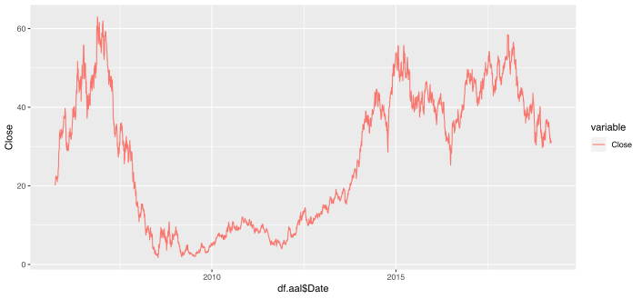
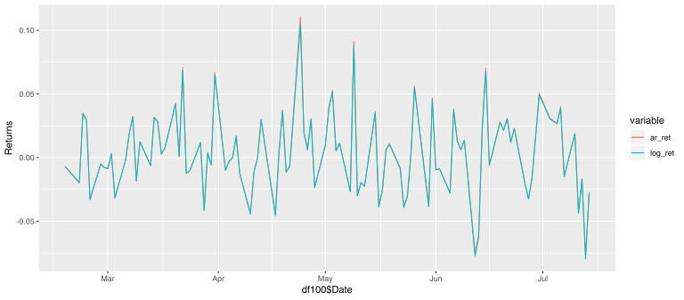
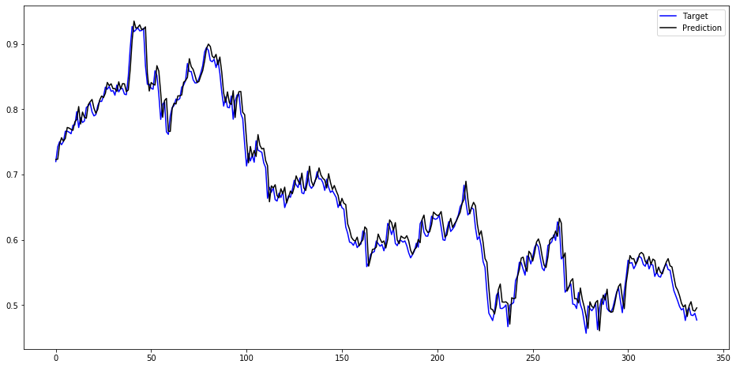

# Recurrent Neural Network Assignment: Time Series Analisys 

Igor Ostaptchenko <igor_ost@wayne.edu>


The  purpose is to evaluate ``Recurrent Neural Network`` for the purpose of forcasting the rate of return of American Airlines stock (AAL). The closing price starting from 09/27/2005 until 03/21/2019 is used as the basis for the analysis. Data is obtained form from Yahoo Finance.


The `R` source for this report is: [arima.R](arima.R)

The datasets: 

* AAL Daily: [stock_market_data-AAL.csv](stock_market_data-AAL.csv)

## Time Series Analisys
Time series is a series of data that occurs at a fixed intervals, for example: daily stock price, seasonal sales, etc. 
Time series analysis is the techniques of processing data based on the assumption that the successive values in the data represents measurements that take place in equal intevals. The purpose of time series analysis is to forecast future values of the time series variables. 

### AAL

American Airlines Group Inc (AAL) operates as a network air carrier; providing air transportation for passengers and cargo. As of December 31, 2018, the company operated a mainline fleet of 956 aircraft, whch makes it a major American airline company, and that is why we chose it for analysis. The data set is composed of the following parameters:
* Date: on which the price is given.
* High: is the highest price on that day.
* Low: is the lowest price on that day.
* Open: is the price at which the stock opened, when the stock market opened on that day.
* Close: is the closing price on that day when the market closed. We based our analysis on this parameter.




## Fitting ARIMA


### Arithmetic and Log Returns

The `R` functions to calculate returns are as follows:

```r
ar_ret <- function(P) {c(NA, P[2:length(P)]/P[1:(length(P)-1)] -1)}
log_ret <- function(P) {c(NA, log(P[2:length(P)]/P[1:(length(P)-1)]))}
```

##### Zoomed  look on returns



#### The Augmented Dickey-Fuller Test on Returns

```
> print(adf.test(df.aal$log_ret, alternative = "stationary"))

	Augmented Dickey-Fuller Test

data:  df.aal$log_ret
Dickey-Fuller = -13.709, Lag order = 15, p-value = 0.01
alternative hypothesis: stationary

Warning message:
In adf.test(df.aal$log_ret, alternative = "stationary") :
  p-value smaller than printed p-value
```
The Arithmetic and Log Returns Time Series is stationary enough thus allowing to apply ARIMA class models to forecast the time series.

###  Use Auto.Arima

The `R`s `forecast` package provides `auto.arima` function to select best ARIMA model according to either AIC, AICc or BIC value. The function conducts a search over possible model within the order constraints provided.

The first 3000 returns of `AAL` dataset will be used to train the model.

#### Find the best model for 3000 observations of `AAL` 

```
> aal.ar.autoarima <- auto.arima(df.aal[1:3000,]$ar_ret,
+                                max.order=300,
+                                trace = TRUE)

 Fitting models using approximations to speed things up...
 ...
 Now re-fitting the best model(s) without approximations...

 ARIMA(3,0,3) with non-zero mean : -10184.57

 Best model: ARIMA(3,0,3) with non-zero mean 
 ```

For `ariphmetic` returns the best model is ARIMA(_p_ =3, _d_ = 0, _q_ = 3). Note that _d_ is 0 because the `Returns` is already a differentiated measure.

Let's see about `Log Returns`

```
> aal.ar.autoarima.log <- auto.arima(df.aal[1:3000,]$log_ret,
+                                max.order=300,
+                                trace = TRUE)

 Fitting models using approximations to speed things up...

 ...
 
 Now re-fitting the best model(s) without approximations...

 ARIMA(4,0,5) with zero mean     : -10250.27

 Best model: ARIMA(4,0,5) with zero mean     
 ```

For `Log` returns the best model is ARIMA(_p_ = 4, _d_ = 0, _q_ = 5). Same: _d_ is 0 because the `Log Returns` is already a differentiated measure.

##### Log Returns Fit

```
> print(summary(aal.ar.autoarima.log))
Series: df.aal[1:3000, ]$log_ret 
ARIMA(4,0,5) with zero mean 

Coefficients:
         ar1     ar2     ar3      ar4      ma1      ma2      ma3     ma4      ma5
      0.1674  0.1579  0.1176  -0.8557  -0.1406  -0.1308  -0.1099  0.8818  -0.0110
s.e.  0.2363  0.2416  0.1131   0.1287   0.2400   0.2168   0.0880  0.1263   0.0422

sigma^2 estimated as 0.001914:  log likelihood=5135.17
AIC=-10250.35   AICc=-10250.27   BIC=-10190.28

Training set error measures:
                      ME       RMSE        MAE MPE MAPE      MASE         ACF1
Training set 0.000267983 0.04368722 0.02885307 NaN  Inf 0.7083174 0.0007081013

```

#### Forecasting AAL on Log Returns

Lets run the forecast for 14 days ahead with the Residuals check

```
> f_log <- forecast(aal.ar.autoarima.log,h=14)
> checkresiduals(f_log)

	Ljung-Box test

data:  Residuals from ARIMA(4,0,5) with zero mean
Q* = 18.839, df = 3, p-value = 0.0002952

Model df: 9.   Total lags used: 12
```

##### The Log Return Forecast Errors 

| Test Errors       |            ME |       RMSE |        MAE |      MPE |     MAPE |      MASE | ACF1 |
|-------------------|---------------|------------|------------|----------|----------|-----------|------|
| Training set | 0.0002679830 | 0.04368722 | 0.02885307 | NaN |   Inf |  0.7083174 | 0.0007081013 |
| Test set     | 0.0002783467 | 0.01844228 | 0.01419282 | 97.74705 | 97.74705 |0.3484213           |NA|


##### The Arithemtic Return Forecast Errors 

Similar way the Arithemtic Return Forecast had been done 


| Test Errors       |            ME |       RMSE |        MAE |      MPE |     MAPE |      MASE | ACF1 |
|-------------------|---------------|------------|------------|----------|----------|-----------|------|
| Training set |  -1.406339e-05 |  0.04419841 | 0.02888782      | NaN      | Inf | 0.7071239 | 0.0137817|
| Test set |     -7.936604e-04 | 0.01879774 | 0.01475044 | 106.2668 | 106.2668 | 0.3610654 |        NA|


The Errors of the Log Return forecast smaller everywhere except Mean Errors. The `MPE` and `MAPE` rates are disturbing that is unfortunatelly confirmed by detail analisys of the `Log Returns: Actual vs Predicted` and `Arithmetic Returns: Actual vs Predicted` plots shown above: each line is the day and even visally the forecast errors are seen.


| Test Errors       |            ME |       RMSE |        MAE |      MPE |     MAPE |      MASE | ACF1 |
|-------------------|---------------|------------|------------|----------|----------|-----------|------|
| Arithmetic Return | -7.936604e-04 | 0.01879774 | 0.01475044 | 106.2668 | 106.2668 | 0.3610654 | NA   |
| Log Return        |  0.0002783467 | 0.01844228 | 0.01419282 | 97.74705 | 97.74705 | 0.3484213 | NA   |


###  Use Recurrent Neural Network for Multivraite Time Series 
The absolute values of *Open/Higth/Low/Close* used for the forecasting after being scaled.


```python
#import all libraries
import os
# os.environ["KERAS_BACKEND"] = "plaidml.keras.backend"
import numpy as np
import pandas as pd
import math
import sklearn
import sklearn.preprocessing
import datetime
import matplotlib.pyplot as plt
import tensorflow as tf
from IPython.display import Image
import ml_metrics as metric
import forecasting_metrics as fmetric
#from tensorflow.python.framework import ops
tf.reset_default_graph()
```


```python
# import dataset 
dataset = pd.read_csv('stock_market_data-AAL.csv')
df_stock = dataset.copy()
df_stock = df_stock.dropna().sort_values(by=['Date'])
print(df_stock[:10])
df_stock = df_stock[['Open', 'High', 'Low', 'Close']]
print(df_stock[:10])
print('Dataset shape = ',df_stock.shape)
```

          index        Date    Low   High  Close   Open
    3392      0  2005-09-27  19.10  21.40  19.30  21.05
    3391      1  2005-09-28  19.20  20.53  20.50  19.30
    3390      2  2005-09-29  20.10  20.58  20.21  20.40
    3389      3  2005-09-30  20.18  21.05  21.01  20.26
    3388      4  2005-10-03  20.90  21.75  21.50  20.90
    3387      5  2005-10-04  21.44  22.50  22.16  21.44
    3386      6  2005-10-05  21.75  22.31  22.20  22.10
    3385      7  2005-10-06  22.40  23.00  22.58  22.60
    3384      8  2005-10-07  21.80  22.60  22.15  22.25
    3383      9  2005-10-10  22.10  22.29  22.21  22.28
           Open   High    Low  Close
    3392  21.05  21.40  19.10  19.30
    3391  19.30  20.53  19.20  20.50
    3390  20.40  20.58  20.10  20.21
    3389  20.26  21.05  20.18  21.01
    3388  20.90  21.75  20.90  21.50
    3387  21.44  22.50  21.44  22.16
    3386  22.10  22.31  21.75  22.20
    3385  22.60  23.00  22.40  22.58
    3384  22.25  22.60  21.80  22.15
    3383  22.28  22.29  22.10  22.21
    Dataset shape =  (3393, 4)


### Standardizing the dataset
The scaling is performed using sklearn’s `MinMaxScaler`.


```python
def normalize_data(df):
    min_max_scaler = sklearn.preprocessing.MinMaxScaler()
    df['Open'] = min_max_scaler.fit_transform(df.Open.values.reshape(-1,1))
    df['High'] = min_max_scaler.fit_transform(df.High.values.reshape(-1,1))
    df['Low'] = min_max_scaler.fit_transform(df.Low.values.reshape(-1,1))
    df['Close'] = min_max_scaler.fit_transform(df['Close'].values.reshape(-1,1))
    return df
df_stock_norm = df_stock.copy()
df_stock_norm = normalize_data(df_stock_norm)
print(df_stock_norm[:10])
```

              Open      High       Low     Close
    3392  0.315980  0.316297  0.291495  0.286648
    3391  0.287239  0.302090  0.293146  0.306259
    3390  0.305305  0.302907  0.308010  0.301520
    3389  0.303005  0.310581  0.309331  0.314594
    3388  0.313516  0.322012  0.321222  0.322602
    3387  0.322385  0.334259  0.330140  0.333388
    3386  0.333224  0.331156  0.335260  0.334042
    3385  0.341435  0.342423  0.345995  0.340252
    3384  0.335687  0.335892  0.336086  0.333224
    3383  0.336180  0.330830  0.341040  0.334205


### Splitting the dataset into Training and Testing: building X & Y
The whole dataset is split into train, valid and test data. 
The result is: `x_train`, `y_train`, `x_valid`, `y_valid`, `x_test` and `y_test`. This is a crucial part.


```python
# Splitting the dataset into Train, Valid & test data 
valid_set_size_percentage = 10 
test_set_size_percentage = 10 
seq_len = 20 # taken sequence length as 20
def load_data(stock, seq_len):
    data_raw = stock.values
    data = [] 
    for index in range(len(data_raw) - seq_len): 
        data.append(data_raw[index: index + seq_len])
    data = np.array(data);
    valid_set_size = int(np.round(valid_set_size_percentage/100*data.shape[0]));  
    test_set_size = int(np.round(test_set_size_percentage/100*data.shape[0]));
    train_set_size = data.shape[0] - (valid_set_size + test_set_size);
    x_train = data[:train_set_size,:-1,:]
    y_train = data[:train_set_size,-1,:]
    x_valid = data[train_set_size:train_set_size+valid_set_size,:-1,:]
    y_valid = data[train_set_size:train_set_size+valid_set_size,-1,:]
    x_test = data[train_set_size+valid_set_size:,:-1,:]
    y_test = data[train_set_size+valid_set_size:,-1,:]
    return [x_train, y_train, x_valid, y_valid, x_test, y_test]

x_train, y_train, x_valid, y_valid, x_test, y_test = load_data(df_stock_norm, seq_len)
print('x_train.shape = ',x_train.shape)
print('y_train.shape = ', y_train.shape)
print('x_valid.shape = ',x_valid.shape)
print('y_valid.shape = ', y_valid.shape)
print('x_test.shape = ', x_test.shape)
print('y_test.shape = ',y_test.shape)
```

    x_train.shape =  (2699, 19, 4)
    y_train.shape =  (2699, 4)
    x_valid.shape =  (337, 19, 4)
    y_valid.shape =  (337, 4)
    x_test.shape =  (337, 19, 4)
    y_test.shape =  (337, 4)


### Building the Model

#### Parameters, Placeholders & Variables
We will first fix the Parameters, Placeholders & Variables to building any model. The Artificial Neural Network starts with placeholders. Two placeholders is neede in order to fit the model: X contains the network’s inputs (features of the stock (OHLC) at time _T = t_ ) and Y the network’s output: _Price of the stock at T+1_ . The shape of the placeholders corresponds to [None, n_inputs] with [None] meaning that the inputs are a 2-dimensional matrix and the outputs are a 1-dimensional vector. The crucial part is to properly define the input and output dimensions so the neural net in order to design it properly. 
The variable batch size is 10. It controls the number of observations per training batch. The training is stopped when epoch reaches 100.


```python

## Building the Model
# parameters & Placeholders 
n_steps = seq_len-1 
n_inputs = 4 
n_neurons = 64 
n_outputs = 4
n_layers = 2
learning_rate = 0.001
batch_size = 10
n_epochs = 100 
train_set_size = x_train.shape[0]
test_set_size = x_test.shape[0]
tf.reset_default_graph()
X = tf.placeholder(tf.float32, [None, n_steps, n_inputs])
y = tf.placeholder(tf.float32, [None, n_outputs])

```

### Designing the network architecture
The function `get_next_batch` runs the next batch for any model . Then we will write the layers for each model separately.


```python
# function to get the next batch
index_in_epoch = 0;
perm_array  = np.arange(x_train.shape[0])
np.random.shuffle(perm_array)

def get_next_batch(batch_size):
    global index_in_epoch, x_train, perm_array   
    start = index_in_epoch
    index_in_epoch += batch_size 
    if index_in_epoch > x_train.shape[0]:
        np.random.shuffle(perm_array) # shuffle permutation array
        start = 0 # start next epoch
        index_in_epoch = batch_size     
    end = index_in_epoch
    return x_train[perm_array[start:end]], y_train[perm_array[start:end]]
```

Let's run the model using GRU cell: https://en.wikipedia.org/wiki/Gated_recurrent_unit


```python
#GRU 
layers = [tf.contrib.rnn.GRUCell(num_units=n_neurons, activation=tf.nn.leaky_relu)
          for layer in range(n_layers)] 
                                                                  
multi_layer_cell = tf.contrib.rnn.MultiRNNCell(layers)
rnn_outputs, states = tf.nn.dynamic_rnn(multi_layer_cell, X, dtype=tf.float32)
stacked_rnn_outputs = tf.reshape(rnn_outputs, [-1, n_neurons]) 
stacked_outputs = tf.layers.dense(stacked_rnn_outputs, n_outputs)
outputs = tf.reshape(stacked_outputs, [-1, n_steps, n_outputs])
outputs = outputs[:,n_steps-1,:] # keep only last output of sequence
```

### Cost function function to optimize the model

The cost function is used to generate a measure of deviation between the network’s predictions and the actual observed training targets. The `MSE` computes the average squared deviation between predictions and targets.


```python
# Cost function
loss = tf.reduce_mean(tf.square(outputs - y))
```

### Optimizer
The optimizer takes care of the necessary computations that are used to adapt the network’s weight and bias variables during training. Those computations invoke the _calculation of gradients_ that indicate the direction in which the _weights and biases have to be changed_ during training in order to minimize the network’s cost function. The development of stable and speedy optimizers is a *major field in neural network and deep learning research*.


```python
#optimizer
optimizer = tf.train.AdamOptimizer(learning_rate=learning_rate) 
training_op = optimizer.minimize(loss)
```

In this model we use Adam (Adaptive Moment Estimation) Optimizer, which is an extension of the stochastic gradient descent, is one of the default optimizers in deep learning development.

### Fitting the neural network model & prediction


The training of the network stops once the maximum number of epochs is reached or another stopping criterion defined by the user applies. The training stops when epoch reaches 100.


```python
# Fitting the model
with tf.Session() as sess: 
    sess.run(tf.global_variables_initializer())
    for iteration in range(int(n_epochs*train_set_size/batch_size)):
        x_batch, y_batch = get_next_batch(batch_size) # fetch the next training batch 
        sess.run(training_op, feed_dict={X: x_batch, y: y_batch}) 
        if iteration % int(5*train_set_size/batch_size) == 0:
            mse_train = loss.eval(feed_dict={X: x_train, y: y_train}) # get the MSE of train
            mse_valid = loss.eval(feed_dict={X: x_valid, y: y_valid}) # get the MSE of validation
            print('%.2f epochs: RMSE train/valid = %.6f/%.6f'%( # print RMSE to compare to ARIMA
                iteration*batch_size/train_set_size, math.sqrt(mse_train), math.sqrt(mse_valid)))
# Predictions
    y_test_pred = sess.run(outputs, feed_dict={X: x_test})

```

    0.00 epochs: RMSE train/valid = 0.487622/0.780604
    5.00 epochs: RMSE train/valid = 0.018719/0.022703
    10.00 epochs: RMSE train/valid = 0.013004/0.013554
    14.99 epochs: RMSE train/valid = 0.012757/0.015028
    19.99 epochs: RMSE train/valid = 0.011127/0.012275
    24.99 epochs: RMSE train/valid = 0.011246/0.012548
    29.99 epochs: RMSE train/valid = 0.010858/0.011753
    34.99 epochs: RMSE train/valid = 0.016264/0.022046
    39.99 epochs: RMSE train/valid = 0.010748/0.011374
    44.98 epochs: RMSE train/valid = 0.010480/0.011718
    49.98 epochs: RMSE train/valid = 0.012252/0.015440
    54.98 epochs: RMSE train/valid = 0.010411/0.011213
    59.98 epochs: RMSE train/valid = 0.010583/0.011508
    64.98 epochs: RMSE train/valid = 0.010860/0.011061
    69.97 epochs: RMSE train/valid = 0.011783/0.012862
    74.97 epochs: RMSE train/valid = 0.010892/0.012171
    79.97 epochs: RMSE train/valid = 0.010369/0.010974
    84.97 epochs: RMSE train/valid = 0.010585/0.011419
    89.97 epochs: RMSE train/valid = 0.011733/0.013727
    94.96 epochs: RMSE train/valid = 0.010623/0.011701
    99.96 epochs: RMSE train/valid = 0.014376/0.018565


```python
#checking prediction output nos 
print(y_test_pred.shape)
```

    (337, 4)


Now we have predicted the scaled stock prices and saved as y_test_pred. We can compare these predicted stock prices with our target scaled stock prices which is y_test.

Let’s compare between our target and prediction.


```python
# ploting the graph
comp = pd.DataFrame({'test':y_test[:,3],'pred':y_test_pred[:,3]})
plt.figure(figsize=(16,8))
plt.plot(comp['test'], color='blue', label='Target')
plt.plot(comp['pred'], color='black', label='Prediction')
plt.legend()
plt.show()
# Print errors
def mape(y_true, y_pred): 
    y_true, y_pred = np.array(y_true), np.array(y_pred)
    return np.mean(np.abs((y_true - y_pred) / y_true)) * 100

errors = {
'ME':  fmetric.me(actual=comp['test'], predicted=comp['pred']),
'RMSE': fmetric.rmse(actual=comp['test'], predicted=comp['pred']),
'MAE':  fmetric.mae(actual=comp['test'], predicted=comp['pred']),
'MPE':  100*fmetric.mpe(actual=comp['test'], predicted=comp['pred']),
'MAPE': mape(comp['test'], comp['pred']),
'MASE': fmetric.mase(actual=comp['test'], predicted=comp['pred']),
}
from pprint import pprint
pprint(errors)

```





    {'MAE': 0.01304961807455235,
     'MAPE': 2.0792257024726557,
     'MASE': inf,
     'ME': -0.0065302705519578,
     'MPE': -1.083089080684156,
     'RMSE': 0.0172993085884861}


    /Users/iostaptchenko/projects/secret/wsu/ie7860/Recurrent Neural Network Assignment/forecasting_metrics.py:171: RuntimeWarning: divide by zero encountered in double_scalars
      return mae(actual, predicted) / mae(actual[seasonality:], _naive_forecasting(actual, seasonality))


The picture show the predicted values closely follow the target. The forecasting errors are printed to be compared with ARIMA.


## Conclusions

The error metrics compared in the table bellow:


| Forecasting method |            ME |       RMSE |        MAE |       MPE |     MAPE | MASE      |
|--------------------|---------------|------------|------------|-----------|----------|-----------|
| ARIMA              |  0.0002783467 | 0.01844228 | 0.01419282 |  97.74705 | 97.74705 | 0.3484213 |
| RNN                | -0.0065302706 | 0.01729931 | 0.01304962 |  -1.08309 |  2.07923 | Inf       |


While `RMSE`, `MAE` are at the same scale . Where `RNN` is superriour is in `MPE` and `MAPE`. The ARIMA error values for `MPE` and `MAPE` on this dataset renders it useles for predictions.
The RNN  has an advantage in multivariate Time Series analisys: a few variables had been fed to network simultaniously and contributed to prediction.
The 'R's ARIMA fit was done in signigicantly less time then training of RNN, that are more computationly intensive on the training phase.

## Literature

* https://github.com/borodark/wsu/blob/master/methods/casestudy/toc.md
* Robert H. Shumway David S. Stoffer, Time Series Analysis and Its Applications With R Examples, Fourth Edition
* Ratnadip Adhikari R. K. Agrawal, An Introductory Study on Time Series Modeling and Forecasting
* Analysis of Financial Time Series, Financial Econometrics, RUEY S. TSAY University of Chicago
* Tsay, Ruey S., An introduction to analysis of financial data with R/Ruey S. Tsay. p. cm. Includes index. ISBN 978-0-470-89081-3
* An Empirical Evaluation of Generic Convolutional and Recurrent Networks for Sequence Modeling, Shaojie Bai, J. Zico Kolter, Vladlen Koltun
* Temporal Convolutional Networks: A Unified Approach to Action Segmentation by Colin Lea Rene ́ Vidal Austin Reiter Gregory D. Hager, Johns Hopkins University
* A comparison of performance of several artificial intelligence methods for forecasting monthly discharge time series by Wen-Chuan Wang, Kwok-Wing Chau, Chun-Tian Cheng, Lin Qiu, Journal of Hydrology, Vol. 374, No. 3-4, 2009, pp 294–306
* https://people.duke.edu/~rnau/411diff.htm
