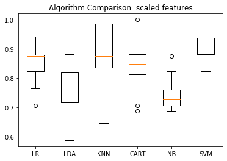
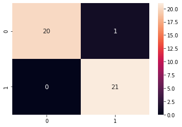

SVM on the Sonar Dataset


```python
import matplotlib.pyplot as plt
## Importing required libraries
import numpy as np
%matplotlib inline
#%matplotlib notebook
import seaborn as sns
import pandas as pd
df = pd.read_csv('sonar.csv', header=None)
x_unscaled = df.sample(frac=1, replace=True, random_state=1)
y = x_unscaled[60]
x_unscaled.drop([60],axis=1, inplace=True)
x_unscaled[[10,50]].describe()

```


<div>
<style scoped>
    .dataframe tbody tr th:only-of-type {
        vertical-align: middle;
    }

    .dataframe tbody tr th {
        vertical-align: top;
    }

    .dataframe thead th {
        text-align: right;
    }
</style>
<table border="1" class="dataframe">
  <thead>
    <tr style="text-align: right;">
      <th></th>
      <th>10</th>
      <th>50</th>
    </tr>
  </thead>
  <tbody>
    <tr>
      <th>count</th>
      <td>208.000000</td>
      <td>208.000000</td>
    </tr>
    <tr>
      <th>mean</th>
      <td>0.232959</td>
      <td>0.017114</td>
    </tr>
    <tr>
      <th>std</th>
      <td>0.140313</td>
      <td>0.013203</td>
    </tr>
    <tr>
      <th>min</th>
      <td>0.028900</td>
      <td>0.001500</td>
    </tr>
    <tr>
      <th>25%</th>
      <td>0.119125</td>
      <td>0.007900</td>
    </tr>
    <tr>
      <th>50%</th>
      <td>0.230200</td>
      <td>0.014450</td>
    </tr>
    <tr>
      <th>75%</th>
      <td>0.294425</td>
      <td>0.021600</td>
    </tr>
    <tr>
      <th>max</th>
      <td>0.734200</td>
      <td>0.100400</td>
    </tr>
  </tbody>
</table>
</div>


```python

plt.figure(figsize=(16,8))
plt.title('Density Plot for the UN-scaled Features in Dataset')
for i in x_unscaled.columns:
    # Draw the density plot
    sns.distplot(x_unscaled[i], hist = False, kde = True,
                 kde_kws = {'linewidth': 1})
    
```


## Scale the features
The SMV performs faster if features are scaled


```python
from sklearn.preprocessing import StandardScaler
scaler = StandardScaler()
scaler.fit(x_unscaled)
x = pd.DataFrame(scaler.transform(x_unscaled), index=x_unscaled.index, columns=x_unscaled.columns)
print("x shape: ",x.shape)
x[[10,50]].describe()
```

    x shape:  (208, 60)


<div>
<style scoped>
    .dataframe tbody tr th:only-of-type {
        vertical-align: middle;
    }

    .dataframe tbody tr th {
        vertical-align: top;
    }

    .dataframe thead th {
        text-align: right;
    }
</style>
<table border="1" class="dataframe">
  <thead>
    <tr style="text-align: right;">
      <th></th>
      <th>10</th>
      <th>50</th>
    </tr>
  </thead>
  <tbody>
    <tr>
      <th>count</th>
      <td>2.080000e+02</td>
      <td>2.080000e+02</td>
    </tr>
    <tr>
      <th>mean</th>
      <td>-2.989062e-17</td>
      <td>1.024821e-16</td>
    </tr>
    <tr>
      <th>std</th>
      <td>1.002413e+00</td>
      <td>1.002413e+00</td>
    </tr>
    <tr>
      <th>min</th>
      <td>-1.457818e+00</td>
      <td>-1.185540e+00</td>
    </tr>
    <tr>
      <th>25%</th>
      <td>-8.132420e-01</td>
      <td>-6.996136e-01</td>
    </tr>
    <tr>
      <th>50%</th>
      <td>-1.971152e-02</td>
      <td>-2.022988e-01</td>
    </tr>
    <tr>
      <th>75%</th>
      <td>4.391181e-01</td>
      <td>3.405716e-01</td>
    </tr>
    <tr>
      <th>max</th>
      <td>3.580913e+00</td>
      <td>6.323535e+00</td>
    </tr>
  </tbody>
</table>
</div>


```python
plt.figure(figsize=(16,16))
plt.title('Density Plot for Sonar scaled Features in Dataset')
for i in x.columns:
    # Draw the density plot
    sns.distplot(x[i], hist = False, kde = True,
                 kde_kws = {'linewidth': 1})
    
```


## Fitting a Support Vector Machine
Use Scikit-Learn's support vector classifier to train an SVM model on this data. Let'set the  𝐶  parameter to a very large number.


```python
from sklearn.svm import SVC # "Support vector classifier"
from timeit import default_timer as timer

model = SVC(kernel='linear', C=1E4)
start = timer()
model.fit(x, y)
end = timer()
print(end - start)

model1 = SVC(kernel='linear', C=1E4)
start = timer()
model1.fit(x_unscaled, y)
end = timer()
print(end - start)


```

    0.005107619999762392
    0.03811032199973852


```python
print(len(model.support_vectors_))
#print(model.support_vectors_)

print(len(model1.support_vectors_))
#print(model1.support_vectors_)
```

    52
    60


The SVM fit performed on unscalsed features is 6 times slower and has 8 more support vectors 

From the previous experiences with the Sonar Dataset (https://github.com/borodark/ie7860/blob/master/Feature%20Selection%20and%20Visualization%20Sonar%20Data%20Set.ipynb) we know that several features are more important. Here is 24 best Features by F score: [0  1  3  7  8  9 10 11 12 33 35 36 43 44 45 46 47 48 49 50 51 53 57 59]

Let's fit SVM on 2 and visualize the hyperplane

## Fit SVM on 2 features and visualize the hyperplane


```python
# define the function for plotting the decision boundary
def plot_svc_decision_function(model, ax=None, plot_support=True):
    """Plot the decision function for a 2D SVC"""
    if ax is None:
        ax = plt.gca()
    xlim = ax.get_xlim()
    ylim = ax.get_ylim()
    
    # Create grid to evaluate model
    x = np.linspace(xlim[0], xlim[1], 30)
    y = np.linspace(ylim[0], ylim[1], 30)
    Y, X = np.meshgrid(y, x)
    xy = np.vstack([X.ravel(), Y.ravel()]).T
    P = model.decision_function(xy).reshape(X.shape)
    
    # Plot decision boundary and margins
    ax.contour(X, Y, P, colors='k',
               levels=[-1, 0, 1], alpha=0.5,
               linestyles=['--', '-', '--'])
    
    # Plot support vectors
    if plot_support:
        ax.scatter(model.support_vectors_[:, 0],
                   model.support_vectors_[:, 1],
                   s=50, linewidth=1, color='#000000', facecolors='none');
    ax.set_xlim(xlim)
    ax.set_ylim(ylim)
```


```python
# fit SVM on features [10,50] - 
X = x[[10,50]]
X1 = X.to_numpy()

```


```python
model3 = SVC(kernel='linear', C=1E4)
start = timer()
model3.fit(X, y)
end = timer()
print(end - start)

```

    0.2013787650002996


```python
print("There are ", len(model3.support_vectors_), " support vectors ")
plt.figure(figsize=(16,16))
plt.title('SVM')
plt.scatter(X1[:, 0], X1[:, 1], c=y, s=5, cmap='copper')
plot_svc_decision_function(model3);
```

    There are  99  support vectors 


## Use 'poly' kernel with SVM


```python
poly = SVC(kernel='poly', C=1E4, gamma='scale')
poly.fit(X, y)

```


    SVC(C=10000.0, break_ties=False, cache_size=200, class_weight=None, coef0=0.0,
        decision_function_shape='ovr', degree=3, gamma='scale', kernel='poly',
        max_iter=-1, probability=False, random_state=None, shrinking=True,
        tol=0.001, verbose=False)


```python
print("There are ", len(poly.support_vectors_), " support vectors for poly kernel")
plt.figure(figsize=(12,12))
plt.scatter(X1[:, 0], X1[:, 1], c=y, s=5, cmap='copper')
plot_svc_decision_function(poly);
```

    There are  97  support vectors for poly kernel


## Comparing to other Classifiers

### Scaled features dataset


```python
# Data Processing
from sklearn.model_selection import train_test_split
from sklearn.model_selection import cross_val_score
from sklearn.model_selection import StratifiedKFold

# Metrics
from sklearn.metrics import classification_report
from sklearn.metrics import confusion_matrix
from sklearn.metrics import accuracy_score

# Models
from sklearn.linear_model import LogisticRegression
from sklearn.tree import DecisionTreeClassifier
from sklearn.neighbors import KNeighborsClassifier
from sklearn.discriminant_analysis import LinearDiscriminantAnalysis
from sklearn.naive_bayes import GaussianNB

```


```python
# Create a validation dataset
# Split-out validation dataset
X_train, X_test, Y_train, Y_test = train_test_split(x, y, test_size=0.20, random_state=1)
X_train[[10,50]].head()
```


<div>
<style scoped>
    .dataframe tbody tr th:only-of-type {
        vertical-align: middle;
    }

    .dataframe tbody tr th {
        vertical-align: top;
    }

    .dataframe thead th {
        text-align: right;
    }
</style>
<table border="1" class="dataframe">
  <thead>
    <tr style="text-align: right;">
      <th></th>
      <th>10</th>
      <th>50</th>
    </tr>
  </thead>
  <tbody>
    <tr>
      <th>23</th>
      <td>-1.135619</td>
      <td>-0.487021</td>
    </tr>
    <tr>
      <th>97</th>
      <td>-0.987737</td>
      <td>0.735386</td>
    </tr>
    <tr>
      <th>94</th>
      <td>-0.954159</td>
      <td>-0.479428</td>
    </tr>
    <tr>
      <th>47</th>
      <td>-0.546946</td>
      <td>-0.798317</td>
    </tr>
    <tr>
      <th>10</th>
      <td>-1.312793</td>
      <td>-0.828688</td>
    </tr>
  </tbody>
</table>
</div>


```python
X_test[[10,50]].head()
```


<div>
<style scoped>
    .dataframe tbody tr th:only-of-type {
        vertical-align: middle;
    }

    .dataframe tbody tr th {
        vertical-align: top;
    }

    .dataframe thead th {
        text-align: right;
    }
</style>
<table border="1" class="dataframe">
  <thead>
    <tr style="text-align: right;">
      <th></th>
      <th>10</th>
      <th>50</th>
    </tr>
  </thead>
  <tbody>
    <tr>
      <th>24</th>
      <td>-1.368517</td>
      <td>-0.008688</td>
    </tr>
    <tr>
      <th>54</th>
      <td>-0.631961</td>
      <td>-0.266836</td>
    </tr>
    <tr>
      <th>114</th>
      <td>0.111740</td>
      <td>0.317794</td>
    </tr>
    <tr>
      <th>205</th>
      <td>0.276054</td>
      <td>-0.122577</td>
    </tr>
    <tr>
      <th>115</th>
      <td>-0.014711</td>
      <td>0.386127</td>
    </tr>
  </tbody>
</table>
</div>


```python
# Spot Check Algorithms
models = []
models.append(('LR', LogisticRegression(solver='liblinear', multi_class='ovr')))
models.append(('LDA', LinearDiscriminantAnalysis()))
models.append(('KNN', KNeighborsClassifier()))
models.append(('CART', DecisionTreeClassifier()))
models.append(('NB', GaussianNB()))
models.append(('SVM', SVC(gamma='auto')))

# Evaluate each model in turn
results = []
names = []
for name, model in models:
	kfold = StratifiedKFold(n_splits=10)
	cv_results = cross_val_score(model, X_train, Y_train, cv=kfold, scoring='accuracy')
	results.append(cv_results)
	names.append(name)
	print('%s: %f (%f)' % (name, cv_results.mean(), cv_results.std()))
```

    LR: 0.850368 (0.069524)
    LDA: 0.758824 (0.079809)
    KNN: 0.880147 (0.108518)
    CART: 0.836397 (0.086663)
    NB: 0.747426 (0.057335)
    SVM: 0.904779 (0.053212)


```python
# Compare Algorithms
plt.boxplot(results, labels=names)
plt.title('Algorithm Comparison: scaled features')
plt.show()
```





SVM has the highest median out of all!


```python
# Make predictions on validation dataset
model = SVC(gamma='auto',C=1E10)
start = timer()
model.fit(X_train, Y_train)
end = timer()
print(end - start)
predictions = model.predict(X_test)
```

    0.003969833999690309


```python
# Evaluate predictions
print("There are ", len(model.support_vectors_), " support vectors ")
print(accuracy_score(Y_test, predictions))
print(classification_report(Y_test, predictions))
cm = confusion_matrix(Y_test,predictions)
print('Confusion Matrix:')
sns.heatmap(cm,annot=True,fmt="d", annot_kws={"size": 12}) # font size
```

    There are  91  support vectors 
    0.9761904761904762
                  precision    recall  f1-score   support
    
               0       1.00      0.95      0.98        21
               1       0.95      1.00      0.98        21
    
        accuracy                           0.98        42
       macro avg       0.98      0.98      0.98        42
    weighted avg       0.98      0.98      0.98        42
    
    Confusion Matrix:


    <matplotlib.axes._subplots.AxesSubplot at 0x125836210>





### Unscaled features


```python
# Create a validation dataset
# Split-out validation dataset
X_train, X_test, Y_train, Y_test = train_test_split(x_unscaled, y, test_size=0.20, random_state=1)
# Spot Check Algorithms
models = []
models.append(('LR', LogisticRegression(solver='liblinear', multi_class='ovr')))
models.append(('LDA', LinearDiscriminantAnalysis()))
models.append(('KNN', KNeighborsClassifier()))
models.append(('CART', DecisionTreeClassifier()))
models.append(('NB', GaussianNB()))
models.append(('SVM', SVC(gamma='auto')))

# Evaluate each model in turn
results = []
names = []
for name, model in models:
	kfold = StratifiedKFold(n_splits=10)
	cv_results = cross_val_score(model, X_train, Y_train, cv=kfold, scoring='accuracy')
	results.append(cv_results)
	names.append(name)
	print('%s: %f (%f)' % (name, cv_results.mean(), cv_results.std()))
```

    LR: 0.785294 (0.114080)
    LDA: 0.758824 (0.079809)
    KNN: 0.819485 (0.088426)
    CART: 0.824265 (0.065639)
    NB: 0.747426 (0.057335)
    SVM: 0.631985 (0.066043)


```python
# Compare Algorithms
plt.boxplot(results, labels=names)
plt.title('Algorithm Comparison: unscaled features')
plt.show()
```


### Conclusion
* The SVM classifier is able to reach %98 accuracy and performs faster then MLP - fit takes only `0.003992759000539081` seconds compare to several minutes for Neural Networks 
* The SVM classifier is sensitive to feature sclaing: slower speed and lower precision
